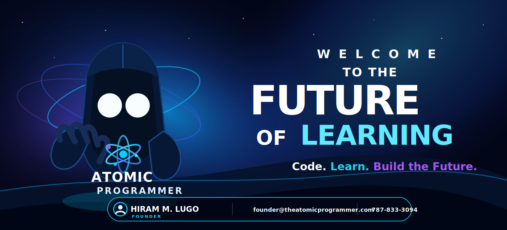

---

## 🪐 About Me

Full-Stack Software Engineer and Founder of **The Atomic Programmer**.

I build:
- ⚛️ Scalable learning platforms
- 🤖 AI-powered systems
- 🚀 Production-ready SaaS apps

---

## 🚀 Current Focus

- Building **Atomic Programmer** (AI-powered education)
- Developing **AI agents & automation systems**
- Exploring **Web3, LLMs, and system design**

---

## 🧠 Tech Stack

**Frontend:** React · Next.js · TypeScript

**Backend:** Node.js · Express · Prisma

**Cloud:** Azure · AWS

**AI:** OpenAI · Azure OpenAI · LLM Systems

---

## 📫 Contact

- ✉️ founder@theatomicprogrammer.com
- 📞 787-833-3094

---

## ⚡ Philosophy

> Small Steps. Atomic Impact.
