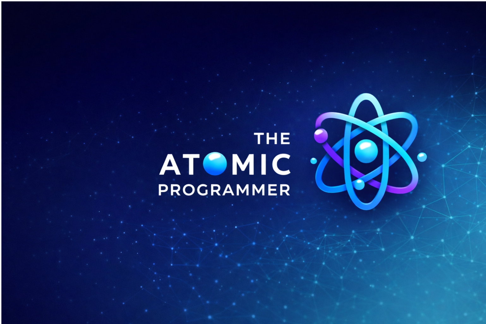
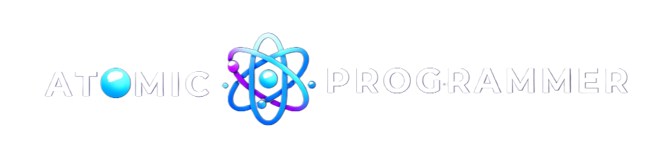
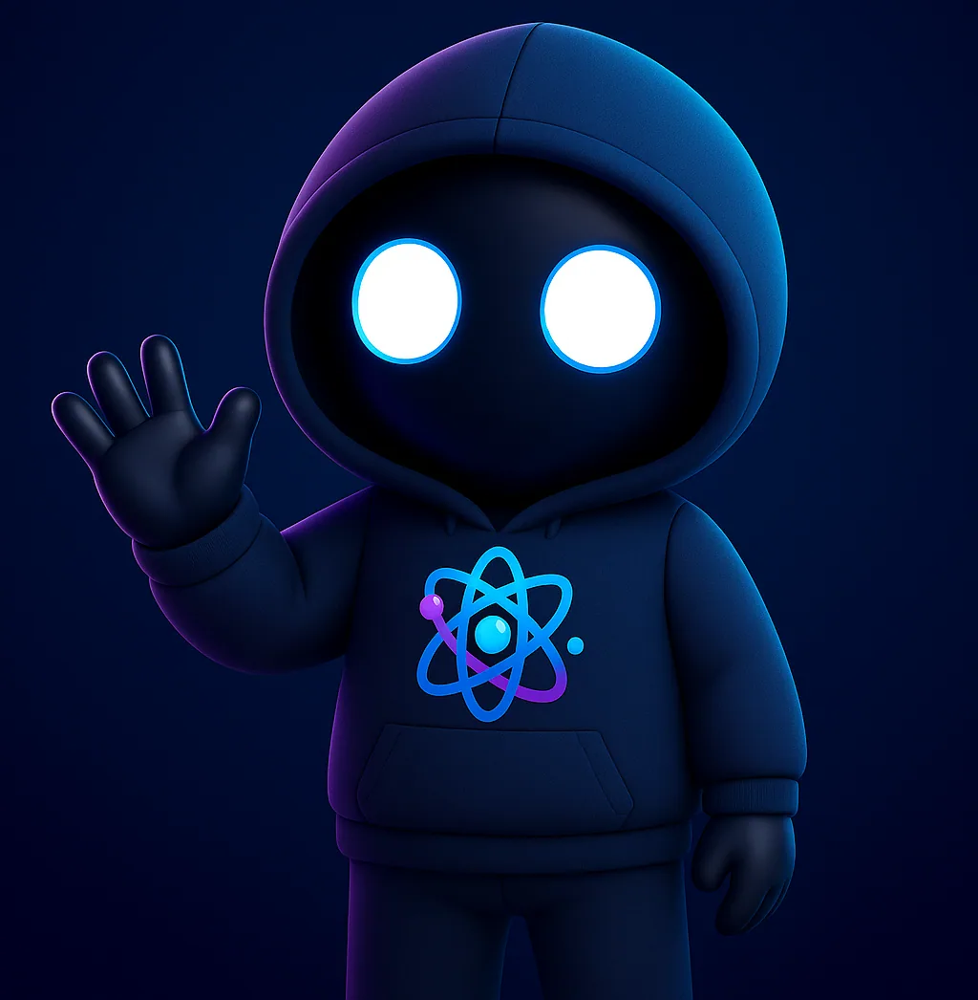
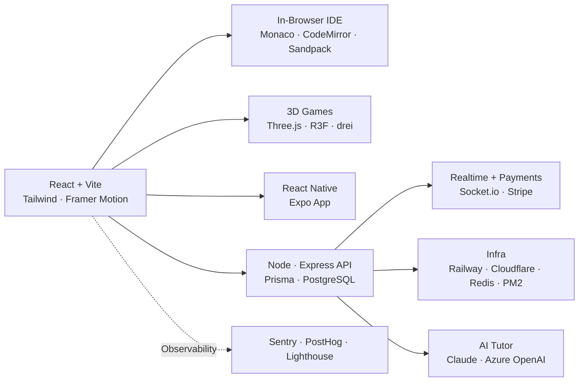

  

  

  

 

## 🪐 About Me

> *Full-Stack Software Engineer and founder of* ***[The Atomic Programmer](http://theatomicprogrammer.com)*** *— a platform built on the belief that the future of learning is atomic: small, powerful, and unstoppable. I don't just write code — I ship production platforms with payments, realtime, 3D, mobile apps, and AI agents. Currently orbiting Pflugerville, Texas.*

<table>
<tr>
<td>

| | |
|:--|:--|
| 🤠 **Location** | Pflugerville, Texas |
| ⚛️ **Brand** | [The Atomic Programmer](http://theatomicprogrammer.com/portfolio/gearhiram1397) |
| 🚀 **Current Role** | Software Engineer @ [Nuvems AI](https://nuvems.com) |
| 🔭 **Side Project** | [The One Gig](https://onegighq.com/) |
| 🧠 **Learning** | Web3 · Solidity · Blockchain · AI/LLMs |
| ✉️ **Contact** | [hiram1397@gmail.com](mailto:hiram1397@gmail.com) |

</td>
<td>

</td>
</tr>
</table>

## 📡 Currently Transmitting

- ⚛️ Building **[The Atomic Programmer](http://theatomicprogrammer.com)** — a full learning platform: in-browser IDE, 3D games, AI tutor "Ask Atom," Stripe billing, gamification, and a React Native app
- 🏥 Building **MiPortalClinico** — HIPAA-compliant, multi-tenant healthcare platform (monorepo)
- 🚛 Building **NuvemsFleet** — fleet & equipment management with an Expo mobile app (App Store + Google Play)
- 🤖 Shipping **AI-powered WhatsApp agents** to automate service intake and document workflows
- 🔗 Exploring **Web3, Solidity, smart contracts & decentralized apps**

## 🛠️ How I Build The Atomic Programmer

> A real, in-production system — not a tutorial project.

```mermaid
flowchart LR
    A["React + Vite<br/>Tailwind · Framer Motion"] --> B["In-Browser IDE<br/>Monaco · CodeMirror · Sandpack"]
    A --> C["3D Games<br/>Three.js · R3F · drei"]
    A --> G["React Native<br/>Expo App"]
    A --> D["Node · Express API<br/>Prisma · PostgreSQL"]
    D --> E["Realtime + Payments<br/>Socket.io · Stripe"]
    D --> F["Infra<br/>Railway · Cloudflare · Redis · PM2"]
    D --> H["AI Tutor<br/>Claude · Azure OpenAI"]
    A -.->|Observability| I["Sentry · PostHog · Lighthouse"]
```

## 🚀 Featured Missions

| Mission | Description | Stack |
|:--|:--|:--|
| [⚛️ The Atomic Programmer](http://theatomicprogrammer.com) | Full learning platform — IDE, 3D games, AI tutor, mobile app | React · Node · Prisma · Three.js · Stripe |
| [🏥 MiPortalClinico](https://nuvems.com) | HIPAA-compliant healthcare management | Next.js · Prisma · Azure |
| [🚛 NuvemsFleet](https://nuvems.com) | Fleet & equipment management + Expo mobile app | Expo · Node.js · Azure |
| [💼 The One Gig](https://onegighq.com/) | Connecting talent with opportunity in the gig economy | Full Stack |

## 🤖 AI & Emerging Tech

## 🛸 Tech Arsenal

### 🎨 Frontend

### 🧊 3D · Creative · In-Browser IDE

### 📱 Mobile

### ⚙️ Backend & Languages

### 🗄️ Databases

### ☁️ Cloud · DevOps · Infra

### 🧪 Testing · Quality · Observability

### 🤖 Automation & RPA

### 🧰 Tools & Design

## 🌠 GitHub Stats

  

## 🐍 Galaxy Trail

<picture>
  <source media="(prefers-color-scheme: dark)" srcset="https://raw.githubusercontent.com/GearHiram1397/GearHiram1397/output/github-contribution-grid-snake-dark.svg" />
  <source media="(prefers-color-scheme: light)" srcset="https://raw.githubusercontent.com/GearHiram1397/GearHiram1397/output/github-contribution-grid-snake.svg" />
  
</picture>

## ⚡ Fun Facts

- 🏖️ Born in Puerto Rico 🇵🇷, coding from Pflugerville, Texas 🤠
- ⚛️ Named the brand "Atomic" because every big breakthrough starts with the smallest, most powerful particle
- 🤖 Built AI agents that automate real healthcare and fleet workflows in production
- 🛰️ Shipped an in-browser IDE, 3D games, and a mobile app under one brand
- ☕ Runs on coffee, curiosity, and clean code
- 🤝 Believes in teaching what you learn — the atomic way

## 🌌 Connect With Me

## ☕ Support The Mission

*Enjoying my content or projects? Help fuel the next atomic build!*

